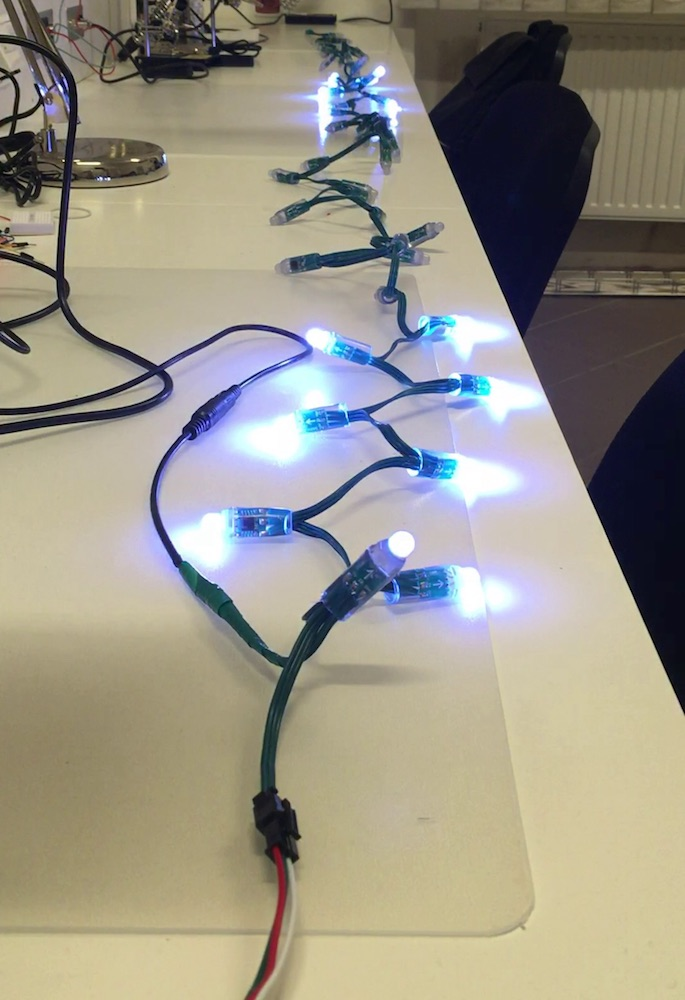

# Let's make: Christmas lights

Arduino nano in a box with small button that is powering string of WS2811 RGB LEDS. Simple firmware that allows new effects to be added easily.

More resources:
* [3D prints](stl)
* [Firmware](firmware/lm-lights) - Arduino Core only, no other libraries needed
* [Photos](pictures)

## How it looks

